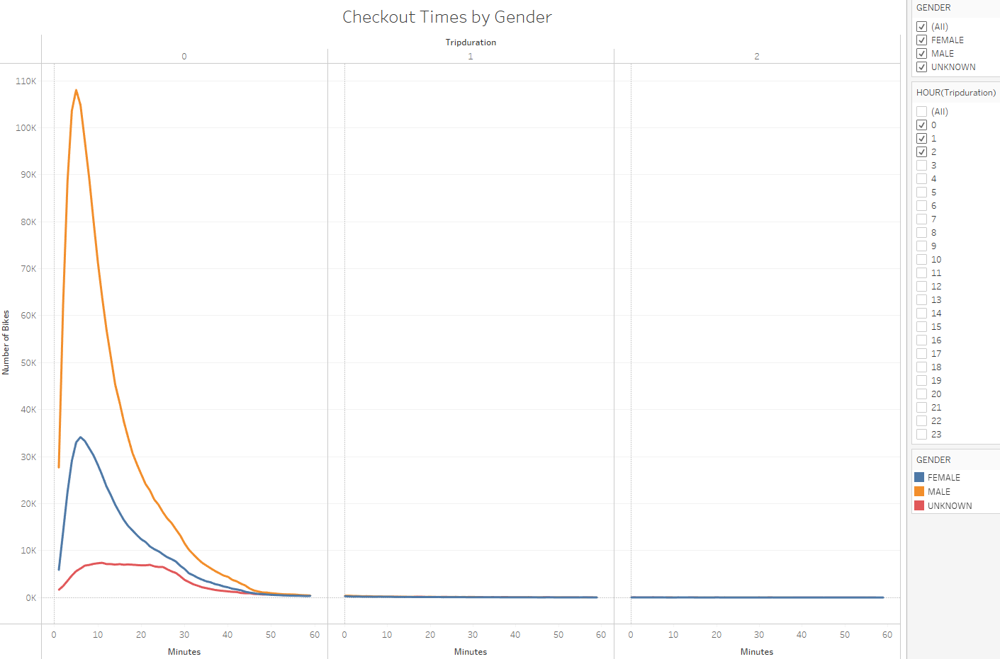

# bikesharing
## Overview of Project
This project is an analysis of NYC Citi Bike  data in Tableau. "Citi Bike is a privately owned public bicycle sharing system serving the New York City boroughs of the Bronx, Brooklyn, Manhattan, and Queens".[1] This analysis utilizes a .csv file of August 2019 NYC Citi Bike, a Python Pandas Dataframe in Jupyter Notebook to transform some data, and Tableau to visualize the data. Tableau excels in forming data visualizations that are easy to interpret by nontechnical stakeholders, coworkers and consumers.
### Purpose
The purpose of this project is to break NYC Citi Bike data into sophisticated visualizations in order to determine and support the eligibility of opening a similar bike rental service in Des Moines, IA. In order to determine and support the eligibility for a similar bike rental service in Des Moines, this project aims to break the NYC Citi Bike data for August 2019 into relevant pieces that can be easily visualized and studied in Tableau. Data analysis in Tabeau gives most popular starting destinations, peak hours of use, and analysis of bike use by time of day, day of week, gender and customer vs. subscriber.
## Results
* Figure 1+ below gives the total # of NYC Citi Bike rides in August, rider breakdown by usertype and gender, and hours of bike checkout.

* Figure 2 below gives the most popular starting locations for NYC Citi Bike

* Figure 3 below gives NYC Citi Bike use duration
  * 0, 1 & 2 listed at the top of the x axis correspond to the number of completed hours of bike use before adding minutes at the bottom of the x axis.

* Figure 4 below gives NYC Citi Bike use duration by gender
  * 0, 1 & 2 listed at the top of the x axis correspond to the number of completed hours of bike use before adding minutes at the bottom of the x axis.

* Figure 5 below gives a heatmap of NYC Citi Bike checkout times by day of week and time of day. 
  * The darker the shade of orange, the greater the bike usage scaling from 360 minumum to 44,905 maximum.

* Figure 6 below gives the same heatmap in figure 5 further broken frther by rider gender.
  * The darker the shade of orange, the greater the bike usage scaling from 37 minumum to 30,749 maximum.

* Figure 7 below gives a heatmap of NYC Citi Bike use per day of week by gender and usertype (customer or subscriber).
  * The darker the shade of blue, the greater the bike usage scaling from 3,528 minimum to 259,316 maximum.

## Summary
The results breakdown popular starting location in NYC and bike checkout times by day of week, time of day, gender and usertype (customer or subscriber). These results help paint an image of where bikes for our Des Moines bike rental service, and when bikes should be maintained in order to ensure that they are most available during peak usage. Additional visualizations that could be useful to include are usertype by birthyear; this could inform our decisions of whether to include incentives or marked down prices of subscription prices for people of certain age ranges. Another useful visualization is to track bike usage by day of month and across multiple months for insight into bike use trends.
## Citations
1. https://en.wikipedia.org/wiki/Citi_Bike
